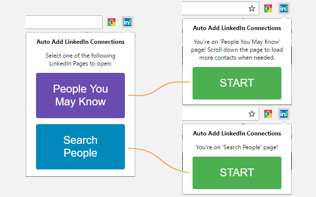
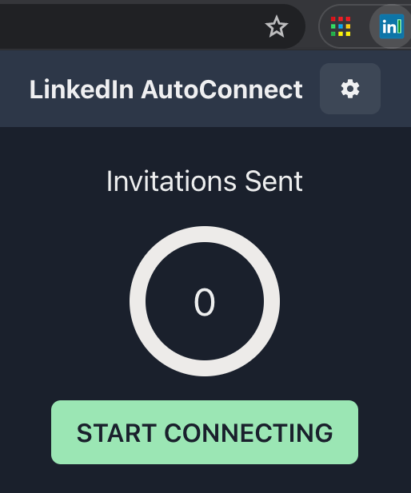
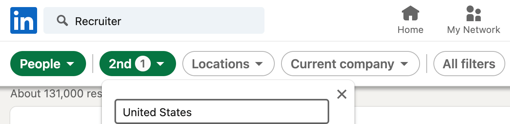

# LinkedIn AutoConnect - Chrome Extension

This extensions is for every LinkedIn user who is tired of manually clicking 'Connect' button when all they want is to connect with everyone available.

## Install

1. Download `linkedin-autoconnect-chrome-extension.zip` from the [latest release of LinkedIn AutoConnect](https://github.com/felladrin/linkedin-autoconnect-chrome-extension/releases) and unzip it.
2. Open Google Chrome, type `chrome://extensions` on your address bar and hit Enter.
3. On the Chrome Extensions page, check the `Developer mode` box. New buttons will be displayed.
4. Click on the button `Load unpacked`.
5. Navigate to the unzipped extension folder, select it and click 'Open'.
6. The extension should now be loaded and enabled on Chrome, and you can use it by clicking the LinkedIn AutoConnect extension icon.

## Usage

After installing, click the extension icon and select a page to go, click "Start" and watch your computer clicking on every "Connect" button it finds until you click "Stop".

## Connecting to specific people

If you want, for example, to connect with all recruiters from a company, click on "Search People" button in the extension popup, and before clicking "Start", narrow down your search by typing "Recruiter" in LinkedIn Search Bar and specifying
the company name and location of the company. And then you can click "Start".

